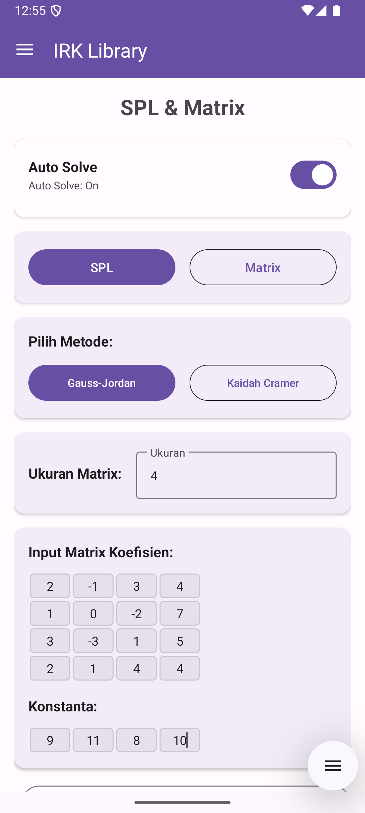
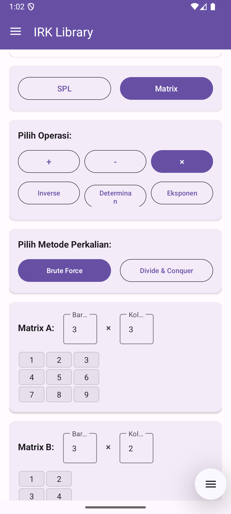

<div align="center"> 
    <h1>IRK Library</h1> 
    <h3>Learning Platform IRK</h3> 
    <p><em>Aplikasi Android yang menggabungkan konsep fundamental mata kuliah IRK</em></p> 
    <p> 
         
         
         
         
         
    </p> 
    
</div>

## Description

**IRK Library** adalah aplikasi berbasis Android yang menggabungkan beberapa konsep fundamental pada mata kuliah IRK (Ilmu dan Rekayasa Komputasi). Aplikasi ini dirancang sebagai learning platform yang membantu mahasiswa memahami konsep pada matkul-matkul IRK!.

Aplikasi ini hadir dengan 5 fitur utama:
- **Sistem Persamaan Linear & Operasi Matrix** - Implementasi algoritma Gauss-Jordan, Cramer, dan berbagai operasi matrix
- **Kriptografi** - Caesar Cipher dan RSA Algorithm dengan step-by-step explanation  
- **Huffman Coding** - Visualisasi tree construction dan proses encoding/decoding
- **References** - Kumpulan slide perkuliahan dari mata kuliah IRK dengan fitur pencarian menggunakan algoritma KMP
- **About** - Info tentang pembuat aplikasi dan motivasi pengembangan

Logo aplikasi ini berupa buku dengan tulisan "A" yang merepresentasikan harapan agar aplikasi ini dapat membantu mahasiswa meraih indeks A! 

## Tech Stack

- **Language**: Kotlin
- **Platform**: Android (API 24+)
- **Architecture**: MVVM (Model-View-ViewModel)
- **UI Framework**: 
  - Navigation Drawer dengan Fragment-based architecture
  - Material Design 3 components
  - Custom views untuk visualisasi tree
- **Libraries**:
  - Navigation Component untuk navigasi antar fragment
  - ViewBinding untuk binding layout
  - RecyclerView untuk list tampilan
  - Custom Canvas untuk drawing Huffman tree
- **Algorithm Implementation**:
  - Divide and Conquer untuk perkalian dan eksponensiasi matrix
  - Brute Force untuk operasi matrix dasar
  - KMP (Knuth-Morris-Pratt) untuk string matching di fitur references

## Installation Guide

### Prasyarat
- Android device dengan API level 24+ (Android 7.0 Nougat)
- Minimal 8MB storage space

### Langkah Instalasi
1. **Download APK**
   
   Download file irk-library.apk dari repository ini

2. **Install APK**
   - Buka file APK yang sudah didownload
   - Allow installation from unknown sources jika diminta
   - Tap "Install" dan tunggu proses selesai

3. **Run Application**
   - Buka aplikasi "IRK Library"
   - Aplikasi siap digunakan!

## Features Overview

### 1. SPL & Matrix Operations

Fitur ini mengimplementasikan berbagai algoritma untuk menyelesaikan Sistem Persamaan Linear dan operasi matrix. Terdapat implementasi berbagai strategi algoritma seperti Brute Force dan Divide & Conquer pada operasi matrix.

#### **Sistem Persamaan Linear**
<div align="center">
  <table>
    <tr>
      <td align="center">
        
        
        <br><b>Metode Cramer</b><br>
      </td>
      <td align="center">
        
        
        <br><b>Eliminasi Gauss-Jordan</b><br>
      </td>
    </tr>
  </table>
</div>

#### **Operasi Matrix**
<div align="center">
    <table>
        <tr>
            <td align="center" colspan="3">
            
            
            <br/>
            <b>Penjumlahan dan Pengurangan Matrix</b><br/>
            </td>
        </tr>
        <tr>
            <td align="center" colspan="3">
            
            
            <br/>
            <b>Perkalian Matrix Brute Force dan Divide & Conquer</b><br/>
            </td>
        </tr>
        <tr>
            <td align="center">
            <br/>
            <b>Matrix Inverse</b><br/>
            </td>
            <td align="center">
            <br/>
            <b>Determinan Matrix</b><br/>
            </td>
            <td align="center">
            <br/>
            <b>Eksponensiasi Matrix (DnC)</b><br/>
            </td>
        </tr>
    </table>
</div>

### 2. Cryptography

Implementasi algoritma kriptografi Caesar Cipher dan RSA dengan step-by-step explanation yang mengikuti materi PPT Pak Rinaldi. Mendukung input untuk 256 karakter ASCII.

<div align="center">
  <table>
    <tr>
      <td align="center">
        
        
        <br><b>Caesar Cipher</b><br>
      </td>
      <td align="center">
        
        
        <br><b>RSA Algorithm</b><br>
      </td>
    </tr>
  </table>
</div>

### 3. Huffman Coding

Implementasi lengkap algoritma Huffman Coding dengan visualisasi tree yang interaktif. Fitur ini dilengkapi dengan auto-solve untuk kemudahan penggunaan.

<div align="center">
  <table>
    <tr>
            <td align="center">
            <br/>
            <b>Visualisasi Pohon Huffman</b><br/>
            </td>
            <td align="center">
            <br/>
            <b>Path Tracking</b><br/>
            </td>
            <td align="center">
            <br/>
            <b>Step-by-step Construction</b><br/>
            </td>
        </tr>
        <tr>
            <td align="center">
            <br/>
            <b>Encoding Process</b><br/>
            </td>
            <td align="center">
            <br/>
            <b>Decoding Process</b><br/>
            </td>
            <td align="center">
            <br/>
            <b>Compression Ratio</b><br/>
            </td>
        </tr>
  </table>
</div>

### 4. References

Kumpulan lengkap slide perkuliahan dari mata kuliah IRK dengan fitur pencarian menggunakan algoritma KMP (Knuth-Morris-Pratt) untuk string matching.

<div align="center">
    <table>
        <tr>
            <td align="center">
            
            
            <br/>
            <b>References dengan KMP Search</b><br/>
            </td>
        </tr>
    </table>
</div>

**Mata Kuliah yang Tersedia:**
- **Matematika Diskrit** 
- **Aljabar Linear dan Geometri** 
- **Strategi Algoritma** 

### 5. About

Halaman personal yang berisi informasi tentang developer, motivasi pengembangan aplikasi, dan visi sebagai calon asisten IRK.

<div align="center">
    <table>
        <tr>
            <td align="center">
            
            </br><b>About Developer</b><br/>
            </td>
        </tr>
    </table>
</div>

## Architecture Overview

Aplikasi ini dibangun menggunakan arsitektur **MVVM (Model-View-ViewModel)** untuk memisahkan logic bisnis dari UI dan memudahkan testing serta maintenance.

### Struktur MVVM:
- **Model**: Diimplementasikan dalam folder `data` yang berisi models dan repositories untuk mengelola data aplikasi
- **View**: UI components berupa Fragment yang menampilkan data dan menerima user interaction  
- **ViewModel**: Mengelola state UI dan berkomunikasi dengan repository untuk data processing

### Project Structure:
```
IRK-Library-Android/
├── app/
│   ├── src/main/java/com/irklibrary/app/
│   │   ├── data/                          # Data Layer
│   │   │   ├── models/                    # Data models
│   │   │   │   ├── CryptographyModel.kt
│   │   │   │   ├── HuffmanModel.kt
│   │   │   │   ├── MatrixSPLModel.kt
│   │   │   │   └── SlideModel.kt
│   │   │   └── repositories/              # Data repositories  
│   │   │       ├── CryptographyRepository.kt
│   │   │       ├── HuffmanRepository.kt
│   │   │       ├── MatrixSPLRepository.kt
│   │   │       └── SlideRepository.kt
│   │   └── ui/                            # Presentation Layer
│   │       ├── main/                      # Main Activity
│   │       ├── page1/                     # SPL & Matrix Fragment
│   │       │   ├── MatrixSPLFragment.kt
│   │       │   ├── MatrixSPLViewModel.kt
│   │       │   └── StepsAdapter.kt
│   │       ├── page2/                     # Cryptography Fragment  
│   │       ├── page3/                     # Huffman Coding Fragment
│   │       │   ├── HuffmanTreeView.kt     # Custom tree view
│   │       │   └── ...
│   │       ├── page4/                     # References Fragment
│   │       └── page5/                     # About Fragment
│   └── res/                               # Resources
│       ├── layout/                        # XML layouts
│       ├── drawable/                      # Icons & graphics
│       └── values/                        # Colors, strings, themes
├── screenshots/                           # App screenshots
├── irk-library.apk                       # Signed APK
└── README.md                             # This file
```


## Algorithm Implementation

Aplikasi ini mengimplementasikan berbagai strategi algoritma untuk menyelesaikan masalah komputasi dengan efisien:

### 1. Brute Force - Perkalian Matrix
Implementasi algoritma Brute Force untuk perkalian matrix menggunakan triple nested loop standar untuk menghitung setiap elemen hasil matrix. Kompleksitas waktu: **O(n³)** untuk matrix n×n.  

### 2. Divide and Conquer - Perkalian Matrix  
Implementasi algoritma Divide and Conquer untuk perkalian matrix dengan membagi matrix menjadi 4 sub-matrix yang lebih kecil dengan menerapkan perkalian secara rekursif pada setiap sub-matrix. Kompleksitas waktu: O(n³). 

### 3. Divide and Conquer - Eksponensiasi Matrix
Implementasi fast matrix exponentiation menggunakan binary exponenentiation, dengan membagi masalah menjadi sub-masalah yang lebih kecil. Kompleksitas waktu: **O(n³ log k)** untuk matrix n×n pangkat k.

### 4. KMP (Knuth-Morris-Pratt) - String Matching
Implementasi algoritma KMP untuk fitur pencarian di halaman References. Menggunakan failure function untuk menghindari pengulangan pencocokan dan Preprocessing pattern untuk membuat LPS (Longest Proper Prefix Suffix) array. Kompleksitas waktu: **O(n + m)**, dimana n = panjang text, m = panjang pattern.

## Author

<table>
  <tr>
    <td align="center">
      <a href="https://github.com/carllix">
        <br />
        <span><b>Carlo Angkisan</b></span><br/>
      </a>
    </td>
  </tr>
</table>